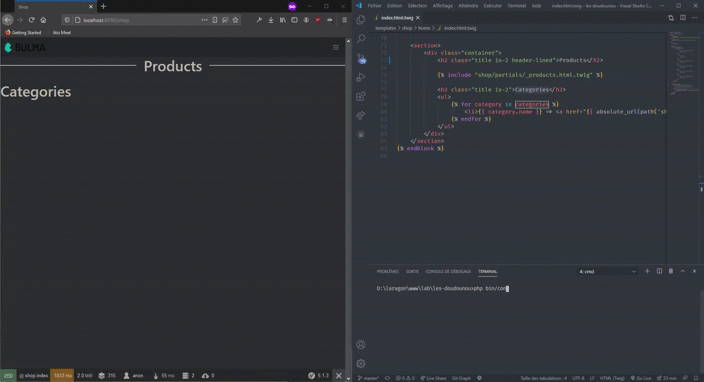

## Demo



## Installation

-   This bundle require NodeJS on your system and added to your %PATH%

**1** Add the bundle to your vendor

```shell
...
```

**Note**: still in beta so [load from the repository](https://getcomposer.org/doc/05-repositories.md#loading-a-package-from-a-vcs-repository)

**2** Register the bundle in `config/bundles.php`

```php
$bundles = [
    ...
    Damian972\ReloadBundle\ReloadBundle::class => ['dev' => true],
];
```

**3** Set the bundle's config in `config/packages/dev/reload.yaml` (**optional**)

```yaml
reload:
    server_port: 8080 # default: 8088
```

**4** Add required npm packages

```shell
php bin/console reload:configure
```

then run at the root of your folder:

```shell
npm update
```

**5** You're ready to go

```shell
php bin/console reload:watch
```
